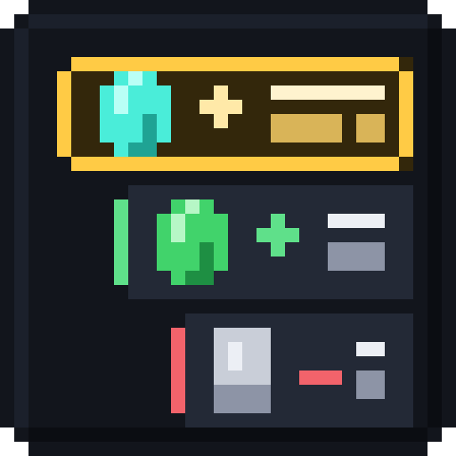
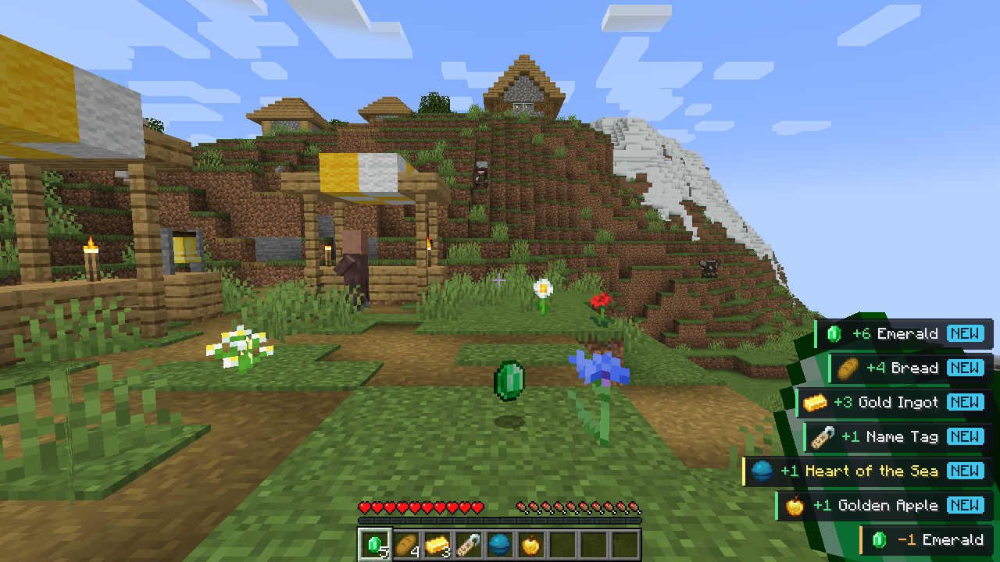
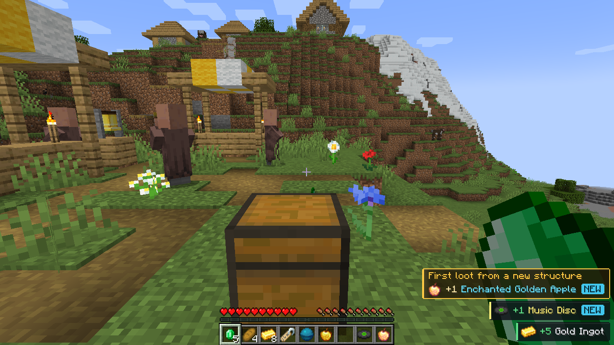
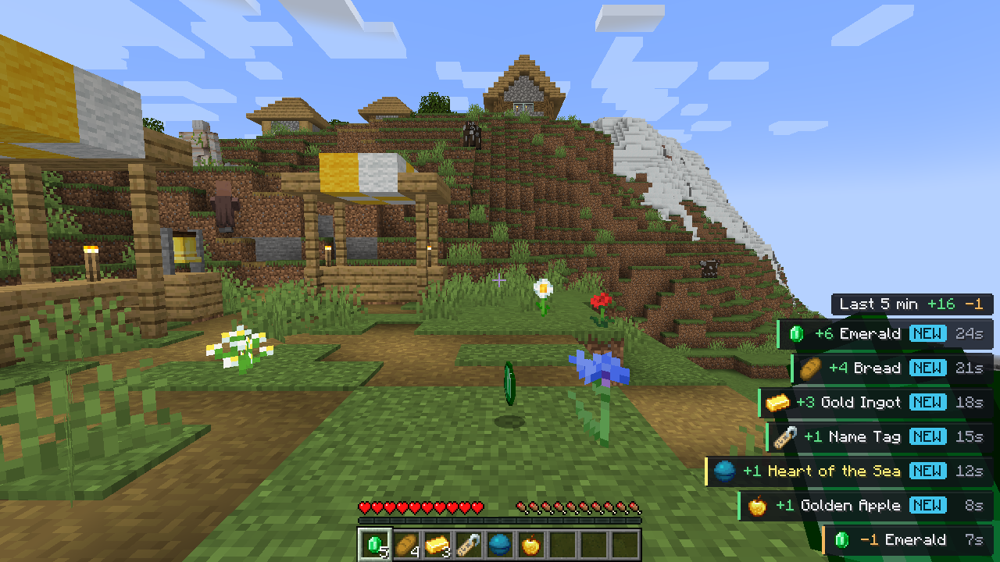
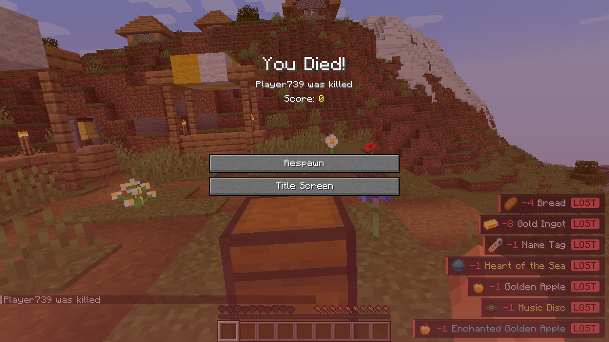

<p align="center">
  
</p>

<h1 align="center">Loot Feed</h1>

<p align="center">
  A feed in the corner of the screen: what you picked up, dropped and lost over the last few minutes.<br>
  Fabric · Forge · NeoForge · Minecraft 1.12.2 – 26.3
</p>

<p align="center">
  <a href="https://github.com/Kristal4ik1/LootFeed/releases/latest">Download</a> ·
  <a href="README.ru.md">Русский</a>
</p>



Client-side only. It works on vanilla servers and nothing has to be installed server-side.

## Features

- Stacks of the same item merge into one row and the counter pops when it grows.
- Items you have never held in this world get a `NEW` tag.
- The first thing you take out of a container in a place you have not looted before is highlighted in gold.
- Everything that vanished on death, and tools that broke in your hands, show up as `LOST`.
- Filters: everything, only new, only rare.
- Hold a key to unfold the history of the last minutes with totals.

| First loot from a new place | History of the last minutes |
| --- | --- |
|  |  |



## Installation

Grab the jar for your loader and Minecraft version from the [releases page](https://github.com/Kristal4ik1/LootFeed/releases/latest) and drop it into the `mods` folder. The file name tells which one it is: `lootfeed-fabric-1.0.0+1.21.4.jar` is the Fabric build compiled against 1.21.4; the table below shows which game versions each build covers. Fabric also needs [Fabric API](https://modrinth.com/mod/fabric-api).

## Controls

| Action | Default key |
| --- | --- |
| Switch filter | `G` |
| Show history while held | `H` |
| Show / hide the feed | unbound |

All three live in the *Miscellaneous* section of the controls screen.

## Configuration

`config/lootfeed.json` is created on first launch.

| Option | Default | Meaning |
| --- | --- | --- |
| `enabled` | `true` | Whether the feed is drawn |
| `anchor` | `bottom_right` | `top_left`, `top_right`, `bottom_left` or `bottom_right` |
| `offsetX`, `offsetY` | `4` | Distance from the screen edges |
| `scale` | `1.0` | Size multiplier, 0.5 – 2.0 |
| `maxRows` | `7` | Rows visible at once (twice as many in history mode) |
| `visibleSeconds` | `10` | How long a row stays on screen |
| `historyMinutes` | `5` | How far back the history goes |
| `showDropped`, `showLost` | `true` | Whether drops and losses are listed |
| `filter` | `all` | `all`, `new` or `rare` |
| `structureRadius` | `64` | Containers farther than this from every looted one count as a new place |

Seen items and looted places are remembered per world in `config/lootfeed/worlds`.

## How it decides what happened

The mod never talks to the server. Every tick it compares the player's inventory with the previous tick:

- more of something — picked up;
- less of something while the drop key was pressed, or while only the inventory screen was open — dropped;
- less of something while a container is open — moved into the container; taking it back cancels out;
- everything that disappears while dead or across a respawn — lost;
- a nearly broken tool that disappears — lost;
- anything else that goes away (placed blocks, eaten food, fired arrows) — ignored.

Structures are not sent to the client, so "new structure" means a container that is farther than `structureRadius` blocks from every container you have looted or stocked before in that dimension.

## Supported versions

| Minecraft | Fabric | Forge | NeoForge |
| --- | --- | --- | --- |
| 1.12 – 1.12.2 | | ✔ | |
| 1.14 – 1.14.4 | ✔ | | |
| 1.15 – 1.15.2 | ✔ | ✔ (1.15.2) | |
| 1.16 – 1.16.5 | ✔ | ✔ (1.16.5) | |
| 1.17 – 1.17.1 | ✔ | ✔ (1.17.1) | |
| 1.18 – 1.18.2 | ✔ | ✔ | |
| 1.19 – 1.19.2 | ✔ | ✔ | |
| 1.19.3 | ✔ | ✔ | |
| 1.19.4 | ✔ | ✔ | |
| 1.20 – 1.20.1 | ✔ | ✔ | |
| 1.20.2 – 1.20.4 | ✔ | ✔ | ✔ (1.20.4) |
| 1.20.5 – 1.20.6 | ✔ | ✔ (1.20.6) | ✔ |
| 1.21 – 1.21.1 | ✔ | ✔ | ✔ |
| 1.21.2 – 1.21.4 | ✔ | ✔ (1.21.3 – 1.21.4) | ✔ |
| 1.21.5 | ✔ | ✔ | ✔ |
| 1.21.6 – 1.21.8 | ✔ | ✔ | ✔ |
| 1.21.9 – 1.21.10 | ✔ | ✔ | ✔ |
| 1.21.11 | ✔ | ✔ | ✔ |
| 26.1 – 26.1.2 | ✔ | ✔ | ✔ |
| 26.2 | ✔ | ✔ | ✔ |
| 26.3 | ✔ | ✔ | ✔ |

Each row is one jar per loader, compiled against the newest version of the range. Of Fabric API only the resource loader module is used.

## Building

```
gradlew build
```

builds every version and puts the jars into `build/libs/<minecraft version>/`. Gradle has to run on JDK 21 for the 1.x versions and on JDK 25 for 26.x, so a full build is done in two passes with `-Ponly`:

```
gradlew build -Ponly=1.20.1,1.21.1
gradlew build -Ponly=1.21.1 -Ploaders=fabric
gradlew :1.21.1:fabric:runClient -Ponly=1.21.1 -Ploaders=fabric
```

`-Ponly` limits the build to the listed Minecraft versions, `-Ploaders` to the listed loaders.

The 1.12.2 build lives in `legacy/forge-1.12.2` and is a separate Gradle project that needs a JDK 8 toolchain:

```
cd legacy/forge-1.12.2
gradlew build
```

## Layout

- `core` — everything that does not depend on Minecraft: inventory tracking, the feed, filters, per-world memory and the renderer, which draws through a tiny `Canvas` interface. Plain Java 8 with unit tests.
- `adapters` — the Minecraft-facing code, written against Mojang names and hooked in with mixins, so the same sources serve every loader. Each folder holds only the classes that differ between game versions.
- `loaders` — the entry points Forge and NeoForge require.
- `legacy/forge-1.12.2` — the 1.12.2 port, which talks to Forge events and MCP names directly.
- `resources` — language files and loader metadata templates.
- `versions/<minecraft>/<loader>` — which adapters and dependency versions a build uses.

## License

MIT
